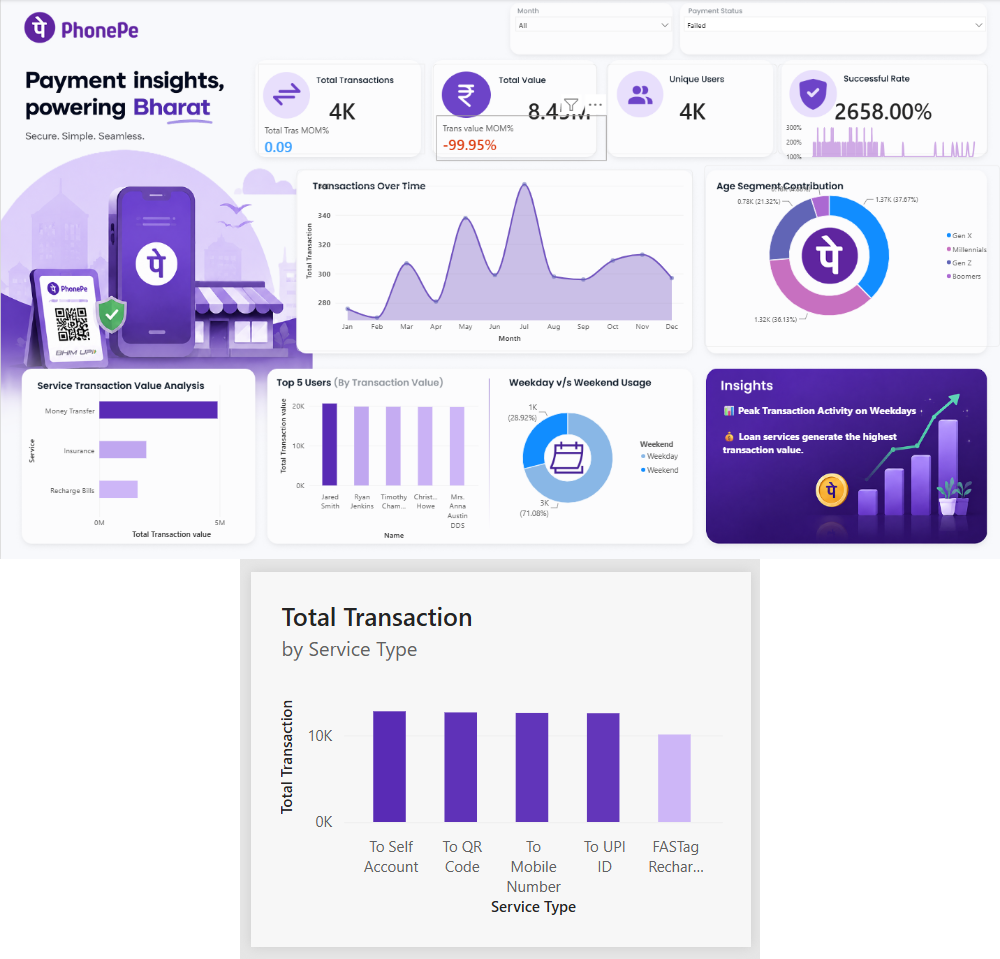
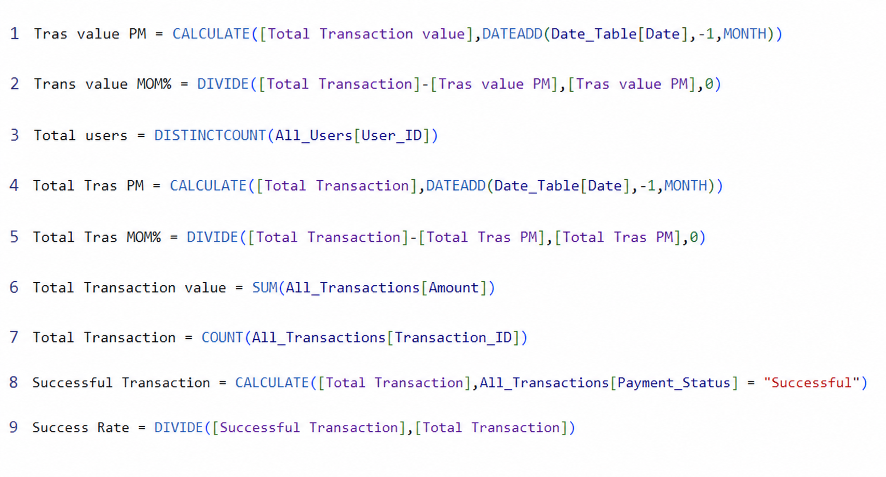
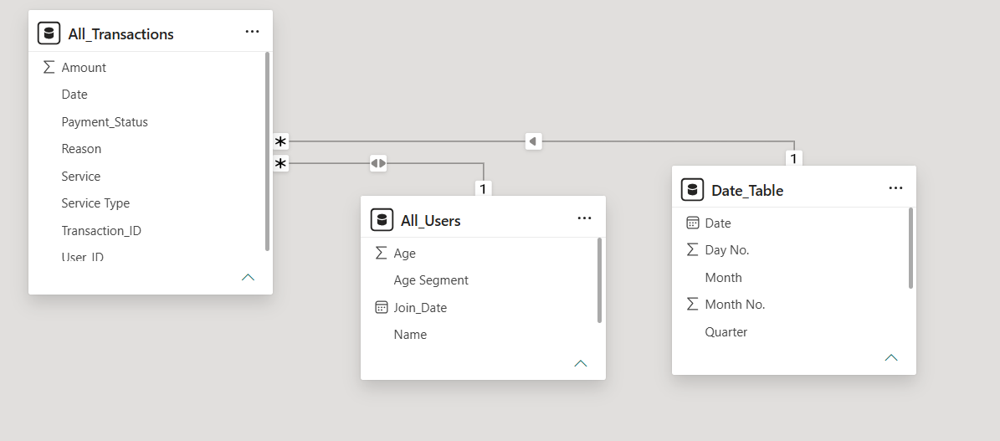

# 📱 PhonePe Business Insights Dashboard | Power BI

> An end-to-end Power BI project that transforms raw PhonePe transaction data into interactive dashboards, delivering meaningful business insights through KPI tracking, DAX measures, and data visualization.

---

# 📌 Project Overview

The PhonePe Business Insights Dashboard is designed to analyze digital payment transactions and user behavior using Power BI. The project demonstrates the complete data analytics workflow, including data transformation, data modeling, DAX calculations, and dashboard development to support data-driven decision-making.

---

# 🎯 Project Objectives

- Analyze PhonePe transaction performance
- Track transaction value and volume
- Monitor registered users and user growth
- Measure payment success rate
- Perform month-over-month (MoM) analysis
- Build interactive dashboards for business insights

---

# 🛠️ Tech Stack

- Power BI Desktop
- Power Query
- DAX (Data Analysis Expressions)
- Data Modeling
- Excel / CSV
- GitHub

---

# 📊 Executive Dashboard

The Executive Dashboard provides a comprehensive overview of business performance through key KPIs such as Total Transaction Value, Total Transactions, Registered Users, Success Rate, and Month-over-Month Growth. Interactive filters allow users to explore trends and monitor overall business performance.

---

# 🧮 DAX Measures

Custom DAX measures were created to calculate business KPIs, month-over-month growth, transaction value, success rate, and user metrics. These calculations enhance the analytical capabilities of the dashboard and provide dynamic insights.

---

# 🗂️ Data Model & Relationships

The project follows a **star schema** data model with **All_Transactions** as the fact table and **All_Users** and **Date_Table** as dimension tables. Relationships based on **User_ID** and **Date** enable efficient filtering, time intelligence, and accurate business analysis.

---

# 📂 Power BI Report

The repository includes the original **Phonepay_Analysis.pbix** file, allowing users to explore the complete interactive dashboard, review the data model, inspect DAX measures, and understand the end-to-end Power BI development process.

---

# 📈 Key Performance Indicators (KPIs)

- Total Transaction Value
- Total Transactions
- Registered Users
- Successful Transactions
- Success Rate
- Previous Month Transaction Value
- Previous Month Transactions
- MoM Transaction Growth
- MoM Transaction Value Growth

---

# 💡 Business Insights

- Monitored transaction trends across different periods.
- Evaluated payment success rate using custom DAX measures.
- Compared month-over-month transaction growth.
- Built interactive KPIs for business monitoring.
- Designed dashboards to support data-driven decision-making.

---

# 🚀 Skills Demonstrated

- Data Cleaning
- ETL using Power Query
- Data Modeling
- DAX Calculations
- KPI Development
- Dashboard Design
- Business Intelligence
- Data Visualization
- Time Intelligence
- Business Storytelling

---

# 📁 Repository Contents

- 📊 Phonepay_Analysis.pbix
- 📷 Executive Dashboard Screenshot
- 🧮 DAX Measures
- 🗂️ Data Model & Relationships
- 📖 Project Documentation

---

# 👨‍💻 Author

**Laxman Ram**

B.Tech Biotechnology | NIT Raipur

Aspiring Data Analyst

📧 Email: *lr7797901@gmail.com*

🔗 LinkedIn: https://linkedin.com/in/laxmanram81

⭐ If you found this project helpful, consider giving it a star.
